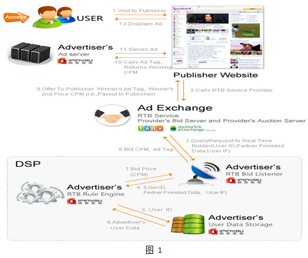

# 广告基本概念与术语总结

## 1. 常见计费术语

+ CPM 千次展现成本  (Cost Per Mille，或者Cost Per Thousand Impressions),以广告每显示1000次作为单位收取广告费用。是西方一些网络广告应用比较成熟的国家所采用的最常规的收费模式之一。
+ CPC 每次点击付费 (Pay per click / PPC，也称作 Cost Per Click / CPC)。
+ CPS (Cost Per Sale), 以实际销售产品数量来换算广告刊登金额。
+ ROI 投资回报率（Return On Investment），即投入产出比，简单来说就是企业所投入资金的回报程度。ROI计算公式为：收益/投资×100%或者ROI=（成本降低+收入增长）/总成本。

详情见[wikipedia][wikipedia].

## 2. 广告系统或模式术语

值得关注的两种广告模式：实时竞价与搜索广告。

搜索广告很直观的理解就是通过购买keyword，网民在搜索引擎上的用Query搜索，搜索引擎匹配Query与keyword，通过一些规则(竞价等)展现购买过相应keyword广告主的广告。相较于最原始的门户网站上banner(现在也有定向广告)这种土豪的单纯求曝光方式来说，搜索广告展现的受众有一点的定向性，但是和实时竞价模式的精确营销相比可谓是相当原始粗暴。

实时竞价模式是当用于浏览网页时，广告交易平台将用户的cookie ID等信息传递给各DSP，各DSP根据广告位特征、cookie ID等信息匹配用户信息并决定是否竞价，决定竞价的话出价多少反馈给交易平台。交易平台决定除了根据出价也会有多种因素决定使用哪个DSP，当确定DSP后向DSP请求广告物料返回给用户。 

可以看出实时竞价模式深入对用户属性的挖掘，广告主的广告精确推送到用户视野，更符合广告追求的方向。

### 2.1 DSP
>DSP（Demand Side Platform，需求方平台）。服务于**广告主**，广告主可以在DSP上设置广告的目标人群(地域等各种属性)，出价等。

DSP的强大在于精准营销，通过设定广告的目标人群以及出价，广告主将广告展现给自己产品的目标受众。

### 2.2 SSP
>SSP（Sell-Side Platform，供应方平台）.供应方平台能够让出版商也介入广告交易，从而使它们的库存广告可用。通过这一平台，出版商希望他们的库存广告可以获得最高的有效每千次展示费用，而不必以低价销售出去。

>互联网里也有成千上万拥有丰富媒体资源和用户流量的网站，他们急需把庞大的流量变现来发展壮大，同时还希望每一个流量都能够达到最大的收益。简单的讲，SSP就是一个媒体服务平台，站长们可以在ssp上管理自己的广告位，控制广告的展现，设置补余等等。

SSP就是给网站主服务的平台，广告库存通俗理解就是网站广告位。

### 2.3 RTB
>RTB（Real Time Bidding，实时竞价）, 一种利用第三方技术在数以百万计的网站上针对每一个用户展示行为进行评估以及出价的竞价技术。 

>跟传统购买形式相比，RTB是在每一个**广告展示曝光的基础上**进行竞价，就是每一个PV都会进行一次展现竞价，谁出价高，谁的广告就会被这个PV看到。Ad Exchange广告平台售卖的不是传统意义上的广告位了，而是访问这个广告位的具体用户，这个用户会有自己的兴趣爱好，广告如果能够投其所好，就能产生最大的收益。这样的用户在互联网海洋里可是稀缺资源，他完全有魅力让广告主来竞相竞价获得在用户面前展现自己的机会。

注：上段引自[浅析Ad Exchange 广告交易模式][baiduued]，不一定是价高者得，决定最终竞价结果有多种因素。

参考：RTB广告展示流程图,步骤解释说明看[原文][pinyou]。

### 2.4 DMP

>DMP(Data-Management Platform)数据管理平台，是把分散的第一、第三方数据进行整合纳入统一的技术平台，并对这些数据进行标准化和细分，从而把这些细分结果推向现有的互动营销环境里。

>RTB允许DSP在的Ad Exchange平台上做交易，在接入Ad Exchange的流量曝光上，针对每一个PV，每一个用户的属性进行分析以及竞价，从而购买到ROI最高的流量，所以RTB的核心在于“人”，在于人群的分析技术。

在DMP这个数据中心里，可以对每个PV对应的人群进行定位划分，了解到当前PV浏览者的属性，才能更精准的进行竞价与营销。

### 参考文档
1. [wikipedia网络广告](http://zh.wikipedia.org/wiki/%E7%BD%91%E7%BB%9C%E5%B9%BF%E5%91%8A)
2. [怎样能通俗介绍一下 Ad Network、Ad Exchange、DSP、SSP、RTB 和DMP  是什么？](http://www.zhihu.com/question/20363959)
3. [品友RTB广告展示流程](http://contest.ipinyou.com/cn/manual.shtml)
4. [浅析Ad Exchange 广告交易模式](http://ueo.baidu.com/?p=1071)
5. [rtb竞价中的cookie-mapping技术](http://neoremind.net/2013/05/rtb%E7%AB%9E%E4%BB%B7%E4%B8%AD%E7%9A%84cookie-mapping%E6%8A%80%E6%9C%AF/)

[wikipedia]: http://zh.wikipedia.org/wiki/%E7%BD%91%E7%BB%9C%E5%B9%BF%E5%91%8A "wikipedia网络广告"
[zhihu]: http://www.zhihu.com/question/20363959 "怎样能通俗介绍一下 Ad Network、Ad Exchange、DSP、SSP、RTB 和DMP  是什么？"
[pinyou]: http://contest.ipinyou.com/cn/manual.shtml "品友RTB广告展示流程"
[baiduued]: http://ueo.baidu.com/?p=1071 "浅析Ad Exchange 广告交易模式"
[cookiemapping]: http://neoremind.net/2013/05/rtb%E7%AB%9E%E4%BB%B7%E4%B8%AD%E7%9A%84cookie-mapping%E6%8A%80%E6%9C%AF/ "/rtb竞价中的cookie-mapping技术"